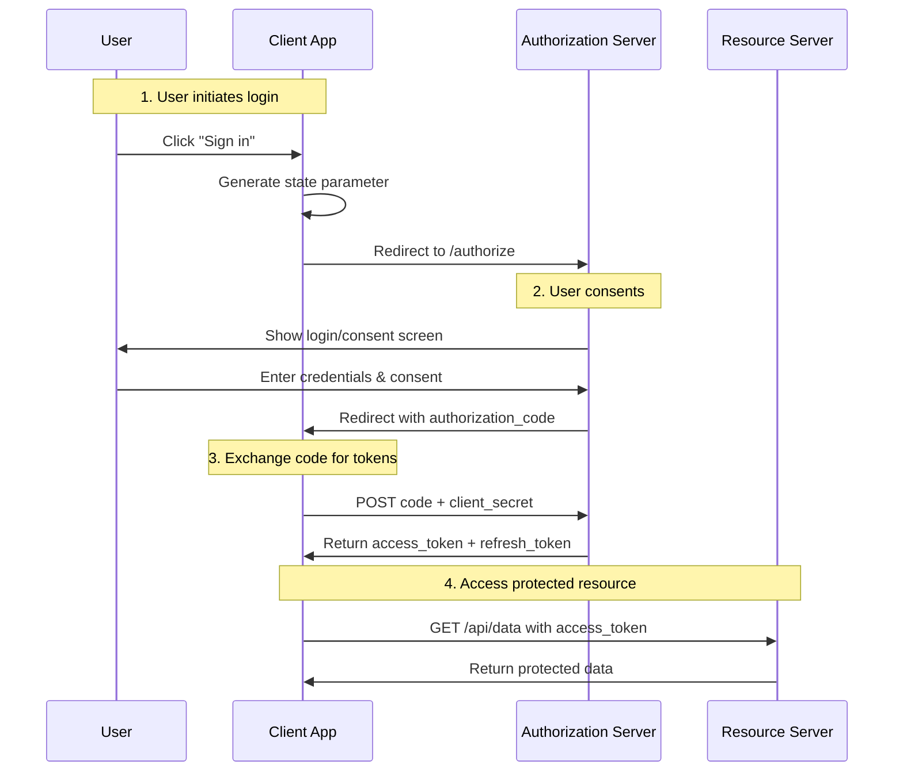
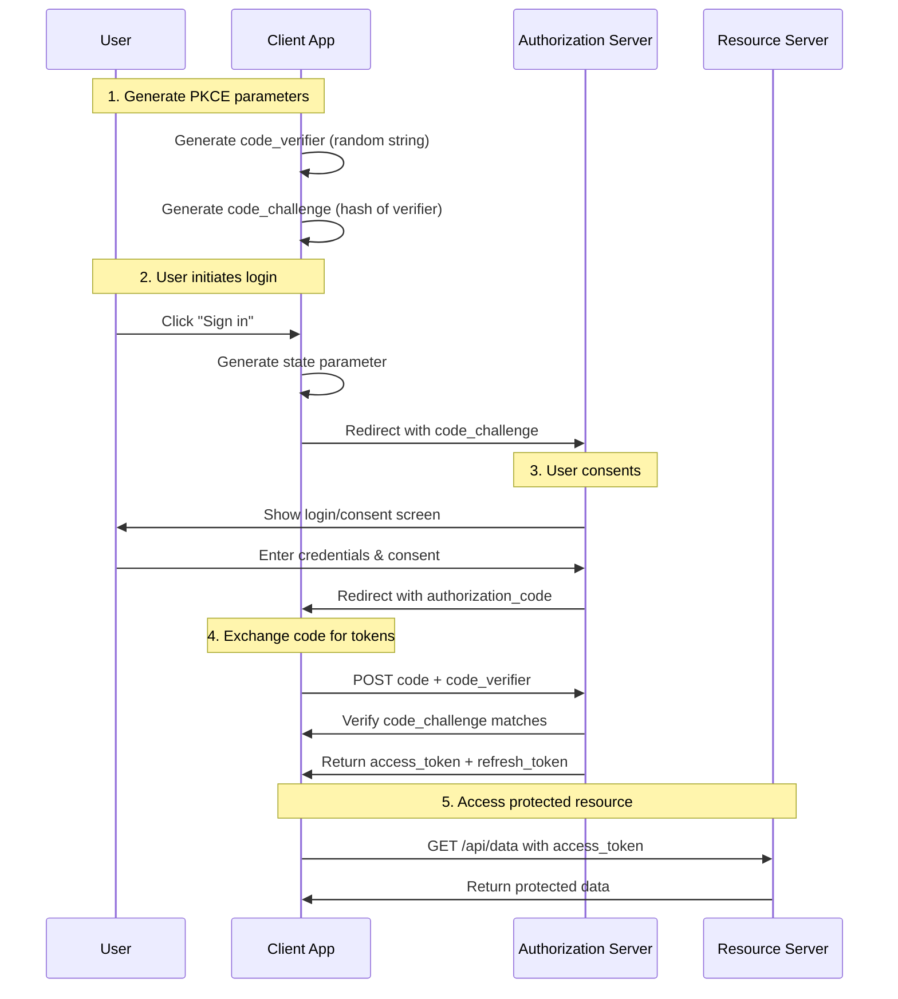

# OAuth 2.0 Authorization Code Flows

The Authorization Code Flow is the most secure and recommended flow for OAuth 2.0. It uses a two-step process: first obtaining an authorization code, then exchanging it for tokens.

## Table of Contents

1. [Authorization Code Flow](#authorization-code-flow)
2. [Authorization Code Flow with PKCE](#authorization-code-flow-with-pkce)
3. [Comparison: Auth Code vs Auth Code with PKCE](#comparison-auth-code-vs-auth-code-with-pkce)

---

## Authorization Code Flow

The standard Authorization Code Flow is designed for server-side applications that can securely store a client secret.

### When to Use

- Web applications with a backend that can store `client_secret`
- Applications where the client secret can be kept confidential

### Prerequisites

- `client_id` - Application identifier
- `client_secret` - Application secret (must be kept confidential)
- `redirect_uri` - Authorized callback URL

### Flow Diagram



### Step-by-Step

1. **User Initiates Login**
   - Client generates a `state` parameter for CSRF protection
   - Client redirects user to authorization server

2. **Redirect to Authorization Server**
   ```
   GET /authorize?
     client_id=YOUR_CLIENT_ID
     &redirect_uri=YOUR_REDIRECT_URI
     &scope=read:profile
     &state=XYZ123
     &response_type=code
   ```

3. **User Consents**
   - User logs in (if not already)
   - User sees consent screen with requested scopes
   - User approves the request

4. **Receive Authorization Code**
   - Authorization server redirects to `redirect_uri`
   - Returns: `code`, `state`

5. **Exchange Code for Tokens**
   ```
   POST /token
   Content-Type: application/x-www-form-urlencoded

   grant_type=authorization_code
   &code=AUTHORIZATION_CODE
   &redirect_uri=YOUR_REDIRECT_URI
   &client_id=YOUR_CLIENT_ID
   &client_secret=YOUR_CLIENT_SECRET
   ```

6. **Receive Tokens**
   ```json
   {
     "access_token": "eyJ...",
     "token_type": "Bearer",
     "expires_in": 3600,
     "refresh_token": "def...",
     "scope": "read:profile"
   }
   ```

7. **Access Protected Resources**
   ```
   GET /api/userinfo
   Authorization: Bearer eyJ...
   ```

### Security Considerations

- **Validate state** to prevent CSRF attacks
- **Use HTTPS** for all communications
- **Store client_secret securely** - never expose in client-side code
- **Use short-lived access tokens** with refresh tokens
- **Validate redirect_uri** matches exactly

---

## Authorization Code Flow with PKCE

PKCE (Proof Key for Code Exchange) is an extension to the Authorization Code Flow that adds security, particularly for public clients that cannot securely store a client secret.

### What is PKCE?

PKCE (pronounced "pixie") is a security extension that prevents authorization code interception attacks. It works by having the client prove it initiated the request that led to the authorization code.

### When to Use

- **Required**: Single Page Applications (SPAs)
- **Required**: Mobile apps (iOS/Android)
- **Recommended**: Any application, even those with a client secret
- **Required by**: OAuth 2.1 specification

### Prerequisites

- `client_id` - Application identifier
- `code_verifier` - A random cryptographically verifiable string
- `code_challenge` - A hash/challenge derived from the code_verifier

### Flow Diagram



### Step-by-Step

1. **Generate PKCE Parameters**
   - Generate a `code_verifier` (random string, 43-128 characters)
   - Create a `code_challenge` from the verifier using S256 method
   ```
   code_verifier = dBjftJeZ4CVP-mB92K27uhbUJU1p1r_wW1gFWFOEjXk
   code_challenge = BASE64URL(SHA256(code_verifier))
   ```

2. **User Initiates Login**
   - Client generates a `state` parameter for CSRF protection
   - Client redirects user with PKCE parameters

3. **Redirect to Authorization Server**
   ```
   GET /authorize?
     client_id=YOUR_CLIENT_ID
     &redirect_uri=YOUR_REDIRECT_URI
     &scope=read:profile
     &state=XYZ123
     &response_type=code
     &code_challenge=CODE_CHALLENGE
     &code_challenge_method=S256
   ```

4. **User Consents**
   - User logs in (if not already)
   - User sees consent screen with requested scopes
   - User approves the request

5. **Receive Authorization Code**
   - Authorization server redirects to `redirect_uri`
   - Returns: `code`, `state`
   - **Server stores code_challenge associated with the code**

6. **Exchange Code for Tokens**
   ```
   POST /token
   Content-Type: application/x-www-form-urlencoded

   grant_type=authorization_code
   &code=AUTHORIZATION_CODE
   &redirect_uri=YOUR_REDIRECT_URI
   &client_id=YOUR_CLIENT_ID
   &code_verifier=CODE_VERIFIER
   ```

7. **Authorization Server Verifies**
   - Server hashes the code_verifier using S256
   - Compares hash with stored code_challenge
   - Only returns tokens if they match

8. **Receive Tokens**
   ```json
   {
     "access_token": "eyJ...",
     "token_type": "Bearer",
     "expires_in": 3600,
     "refresh_token": "def...",
     "scope": "read:profile"
   }
   ```

### Code Example

```java
import java.net.URI;
import java.net.URL;
import java.net.http.HttpClient;
import java.net.http.HttpRequest;
import java.net.http.HttpResponse;
import java.nio.charset.StandardCharsets;
import java.security.MessageDigest;
import java.security.NoSuchAlgorithmException;
import java.util.Base64;
import java.util.UUID;

public class OAuthPKCE {

    private static final String AUTH_SERVER = "https://auth.example.com";
    private static final String CLIENT_ID = "your_client_id";
    private static final String REDIRECT_URI = "https://yourapp.com/callback";

    // Store these temporarily - in production, use secure storage
    private String codeVerifier;

    public static void main(String[] args) throws Exception {
        OAuthPKCE oauth = new OAuthPKCE();

        // Step 1: Generate PKCE parameters
        String codeVerifier = oauth.generateCodeVerifier();
        String codeChallenge = oauth.generateCodeChallenge(codeVerifier);
        String state = UUID.randomUUID().toString();

        // Step 2: Build authorization URL and redirect user
        String authUrl = oauth.buildAuthorizationUrl(codeChallenge, state);
        System.out.println("Redirect user to: " + authUrl);
        // In a real app: response.sendRedirect(authUrl);

        // Step 3: After user is redirected back with authorization code
        String authorizationCode = "RECEIVED_AUTHORIZATION_CODE"; // from callback URL
        oauth.codeVerifier = codeVerifier;

        // Step 4: Exchange code for tokens
        TokenResponse tokens = oauth.exchangeCodeForTokens(authorizationCode);
        System.out.println("Access Token: " + tokens.accessToken);
    }

    /**
     * Generates a random code_verifier (43-128 characters)
     */
    public String generateCodeVerifier() {
        byte[] randomBytes = new byte[32];
        new java.security.SecureRandom().nextBytes(randomBytes);
        String verifier = Base64.getUrlEncoder().withoutPadding()
            .encodeToString(randomBytes);
        // Ensure minimum length of 43 characters
        return verifier.substring(0, Math.min(verifier.length(), 128));
    }

    /**
     * Generates code_challenge from code_verifier using S256 method
     * code_challenge = BASE64URL(SHA256(code_verifier))
     */
    public String generateCodeChallenge(String codeVerifier) {
        try {
            MessageDigest digest = MessageDigest.getInstance("SHA-256");
            byte[] hash = digest.digest(codeVerifier.getBytes(StandardCharsets.UTF_8));
            String challenge = Base64.getUrlEncoder().withoutPadding()
                .encodeToString(hash);
            return challenge;
        } catch (NoSuchAlgorithmException e) {
            throw new RuntimeException("SHA-256 not available", e);
        }
    }

    /**
     * Builds the authorization URL with PKCE parameters
     */
    public String buildAuthorizationUrl(String codeChallenge, String state) {
        return AUTH_SERVER + "/authorize?" +
            "client_id=" + CLIENT_ID +
            "&redirect_uri=" + URI.create(REDIRECT_URI).toString() +
            "&scope=read:profile" +
            "&state=" + state +
            "&response_type=code" +
            "&code_challenge=" + codeChallenge +
            "&code_challenge_method=S256";
    }

    /**
     * Exchanges authorization code for tokens
     */
    public TokenResponse exchangeCodeForTokens(String authorizationCode) throws Exception {
        String tokenUrl = AUTH_SERVER + "/token";

        String body = String.join("&",
            "grant_type=authorization_code",
            "code=" + authorizationCode,
            "redirect_uri=" + URI.create(REDIRECT_URI).toString(),
            "client_id=" + CLIENT_ID,
            "code_verifier=" + codeVerifier
        );

        HttpClient client = HttpClient.newHttpClient();
        HttpRequest request = HttpRequest.newBuilder()
            .uri(URI.create(tokenUrl))
            .header("Content-Type", "application/x-www-form-urlencoded")
            .POST(HttpRequest.BodyPublishers.ofString(body))
            .build();

        HttpResponse<String> response = client.send(request,
            HttpResponse.BodyHandlers.ofString());

        if (response.statusCode() == 200) {
            // Parse JSON response (use Jackson/Gson in production)
            return parseTokenResponse(response.body());
        } else {
            throw new RuntimeException("Token exchange failed: " + response.body());
        }
    }

    private TokenResponse parseTokenResponse(String json) {
        // Simplified parsing - use Jackson/Gson in production
        TokenResponse token = new TokenResponse();
        token.accessToken = extractJsonValue(json, "access_token");
        token.refreshToken = extractJsonValue(json, "refresh_token");
        token.tokenType = extractJsonValue(json, "token_type");
        token.expiresIn = Integer.parseInt(extractJsonValue(json, "expires_in"));
        return token;
    }

    private String extractJsonValue(String json, String key) {
        String search = "\"" + key + "\":";
        int start = json.indexOf(search);
        if (start == -1) return null;
        start += search.length();
        if (json.charAt(start) == '"') {
            start++;
            int end = json.indexOf('"', start);
            return json.substring(start, end);
        } else {
            int end = json.indexOf(',', start);
            if (end == -1) end = json.indexOf('}', start);
            return json.substring(start, end).trim();
        }
    }

    static class TokenResponse {
        String accessToken;
        String refreshToken;
        String tokenType;
        int expiresIn;
    }
}
```

---

## Comparison: Auth Code vs Auth Code with PKCE

| Aspect | Auth Code | Auth Code with PKCE |
|--------|-----------|-------------------|
| **Security** | Good (with client_secret) | Excellent |
| **Client Secret** | Required | Not required |
| **Use Case** | Server-side apps | SPAs, Mobile apps, any app |
| **Attack Prevention** | CSRF, token exposure | CSRF + code interception |
| **Complexity** | Simpler | Slightly more complex |
| **OAuth 2.1** | Deprecated | Required |
| **Browser-based** | Not recommended | Recommended |

### When to Use Each

| Scenario | Recommended Flow |
|----------|-----------------|
| Server-side web app with backend | Auth Code OR Auth Code + PKCE |
| Single Page Application (SPA) | Auth Code + PKCE (required) |
| Mobile app (iOS/Android) | Auth Code + PKCE (required) |
| Desktop/native app | Auth Code + PKCE |
| CLI tool | Auth Code + PKCE or Device Code |

### Why PKCE is Recommended for Everyone

1. **Defense in depth**: Even server-side apps benefit from the extra security layer
2. **Future-proof**: OAuth 2.1 makes PKCE mandatory
3. **No downside**: Doesn't require client_secret
4. **Prevents authorization code theft**: Even if intercepted, the code is useless without the verifier

### Security Threat Model

**Without PKCE**, an authorization code can be intercepted:
1. User logs into malicious app
2. Attacker intercepts the authorization code from redirect
3. Attacker exchanges code for tokens before the legitimate app
4. Attacker gets access to user's account

**With PKCE**, even if code is intercepted:
1. Attacker gets authorization code
2. Attacker tries to exchange code (needs code_verifier)
3. Attack fails - code_verifier never left the client
4. Legitimate client completes flow successfully

### Block Diagram

```mermaid
block-beta
    columns 4

    User["User"]<-->Client["Client App"]
    Client<-->Auth["Auth Server"]
    Auth<-->Resource["Resource Server"]

    note:1,2 PKCE adds<br/>code_verifier<br/>proof step

    style User fill:#e1f5fe
    style Client fill:#e8f5e8
    style Auth fill:#fff3e0
    style Resource fill:#fce4ec
```

### Security Considerations (Both Flows)

- **Validate state** to prevent CSRF attacks
- **Use HTTPS** for all communications
- **Store tokens securely** (server-side, HttpOnly cookies preferred)
- **Use short-lived access tokens** with refresh tokens
- **Implement redirect_uri validation** - must match exactly
- **Monitor for token theft** and implement revocation