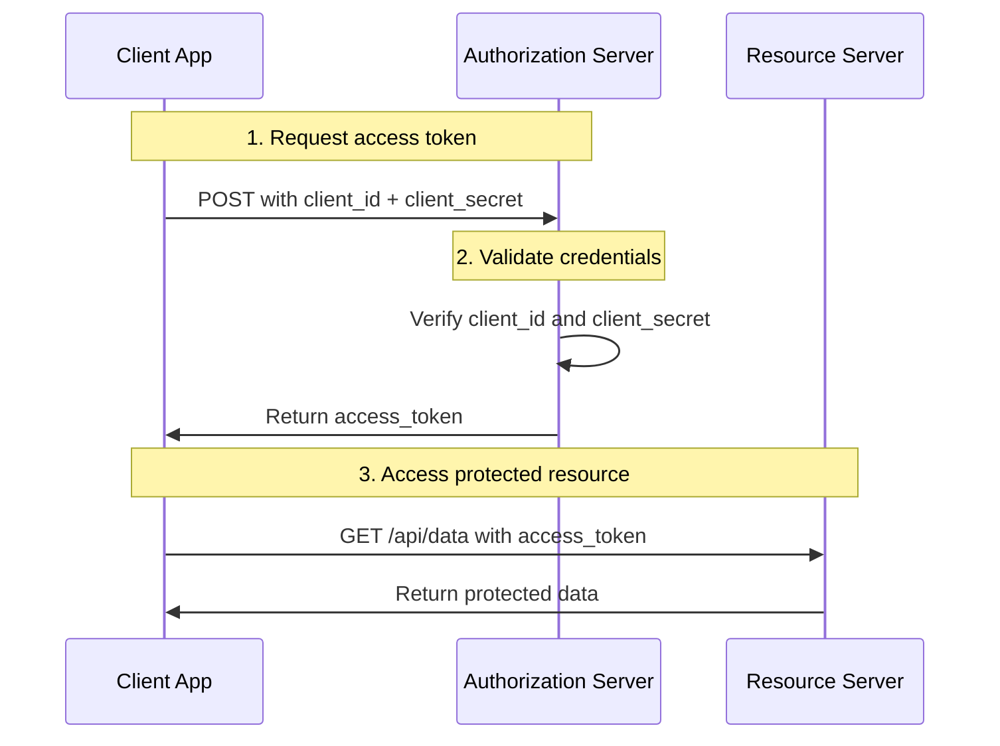
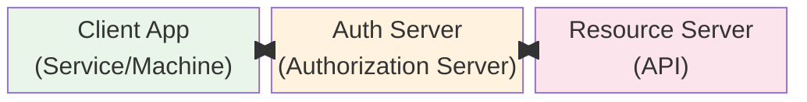

# Client Credentials Flow

The Client Credentials Flow is the simplest OAuth 2.0 flow, used for machine-to-machine (M2M) communication where no user involvement is required.

## Overview

In this flow, the client application authenticates itself directly with the authorization server using its own credentials (client ID and client secret) to obtain an access token.

### When to Use

- Backend services / APIs that need to access their own resources
- CI/CD pipelines
- Scheduled jobs / cron jobs
- Service-to-service communication
- Any scenario where no user is involved

### When NOT to Use

- Applications that need to access user data
- Scenarios requiring user consent or authentication
- Browser-based applications (SPA)

## Flow Diagram



### Step-by-Step

1. **Client Requests Token**
   ```
   POST /token
   Content-Type: application/x-www-form-urlencoded

   grant_type=client_credentials
   &client_id=YOUR_CLIENT_ID
   &client_secret=YOUR_CLIENT_SECRET
   &scope=read:reports write:reports
   ```

2. **Authorization Server Validates**
   - Verifies `client_id` exists
   - Verifies `client_secret` matches
   - Validates requested scopes

3. **Receive Access Token**
   ```json
   {
     "access_token": "eyJ...",
     "token_type": "Bearer",
     "expires_in": 3600,
     "scope": "read:reports write:reports"
   }
   ```

4. **Access Protected Resources**
   ```
   GET /api/reports
   Authorization: Bearer eyJ...
   ```

### Block Diagram



## Security Considerations

### Client Secret Management

- **Never expose client secrets** in client-side code
- **Store securely** using environment variables or secret management systems
- **Rotate regularly** and on suspicion of compromise
- **Use different secrets** for different environments (dev, staging, prod)

### Best Practices

1. **Use HTTPS** for all communications
2. **Implement token caching** to avoid unnecessary token requests
3. **Monitor for anomalies** in token usage
4. **Set appropriate token expiration** (shorter is safer)
5. **Use scope restrictions** - request only necessary scopes

### Comparison with Other Flows

| Aspect | Client Credentials | Authorization Code |
|--------|-----------------|-------------------|
| User involvement | None | Required |
| Use case | M2M | User-facing apps |
| Security level | Medium | High |
| Tokens returned | Access token only | Access + Refresh |
| PKCE support | Not applicable | Recommended |

## Example Implementation

```python
import requests
import os

def get_access_token():
    token_url = os.getenv("AUTH_SERVER_URL") + "/token"

    response = requests.post(token_url, data={
        "grant_type": "client_credentials",
        "client_id": os.getenv("CLIENT_ID"),
        "client_secret": os.getenv("CLIENT_SECRET"),
        "scope": "read:reports"
    })

    if response.status_code == 200:
        return response.json()["access_token"]
    else:
        raise Exception(f"Failed to get token: {response.text}")

# Use the token
token = get_access_token()
headers = {"Authorization": f"Bearer {token}"}
response = requests.get("https://api.example.com/reports", headers=headers)
```