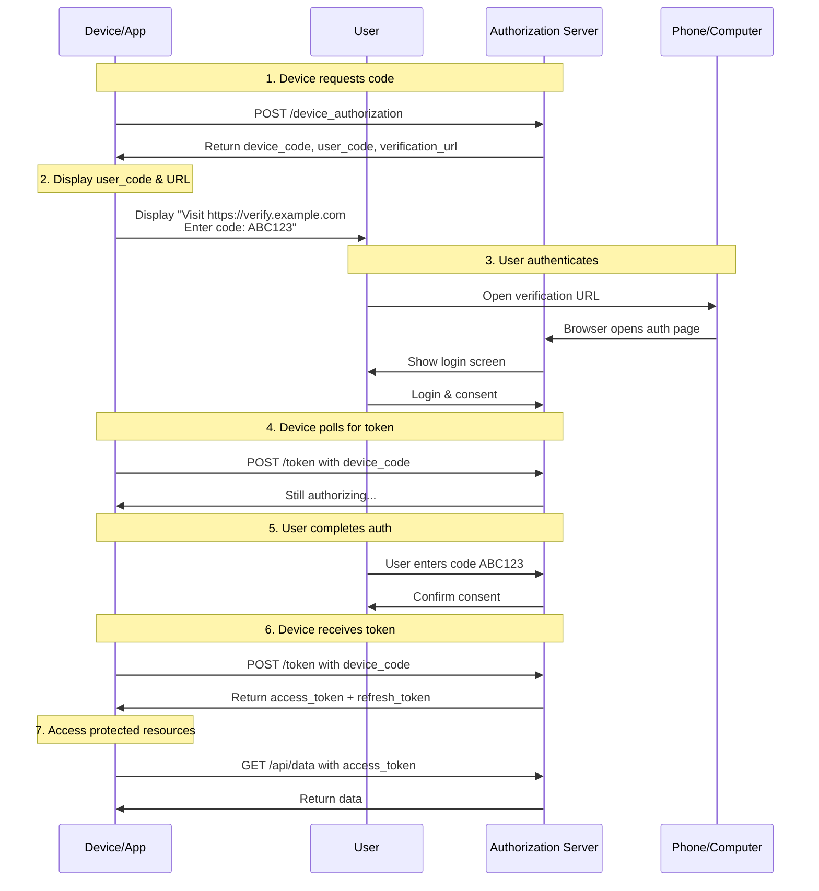

# Device Code Flow

The Device Code Flow is designed for devices that have limited input capabilities or no browser, such as smart TVs, gaming consoles, IoT devices, and CLI tools.

## Overview

Instead of the user authenticating directly on the device, the device displays a short code that the user enters on a separate device (like a phone or computer) to complete authentication.

### When to Use

- **Smart TVs** - Streaming apps (YouTube, Netflix, etc.)
- **Gaming consoles** - PlayStation, Xbox, Nintendo
- **IoT devices** - Smart home devices
- **CLI tools** - Command-line applications
- **Embedded systems** - Devices without keyboards

### Not Suitable For

- Web applications (use Authorization Code + PKCE)
- Mobile apps (use Authorization Code + PKCE)
- Desktop apps with browser access

## Flow Diagram



### Step-by-Step

1. **Device Requests Authorization**
   ```
   POST /device_authorization
   Content-Type: application/x-www-form-urlencoded

   client_id=YOUR_CLIENT_ID
   &scope=read:profile
   ```

2. **Authorization Server Returns Codes**
   ```json
   {
     "device_code": "GmRhmhc... (long string)",
     "user_code": "ABCD-1234",
     "verification_uri": "https://auth.example.com/device",
     "verification_uri_complete": "https://auth.example.com/device?code=ABCD-1234",
     "expires_in": 1800,
     "interval": 5
   }
   ```

3. **Device Displays Instructions**
   - Show the `user_code` (short, human-readable)
   - Show the `verification_uri` (URL to visit)
   - Often displayed as a QR code as well

4. **User Completes Authentication**
   - User opens the verification URL on another device
   - User logs in with their credentials
   - User enters the `user_code` when prompted
   - User consents to the requested scopes

5. **Device Polls for Token**
   - Device polls at the `interval` rate (e.g., every 5 seconds)
   - Uses the `device_code` in each request

   ```
   POST /token
   Content-Type: application/x-www-form-urlencoded

   grant_type=urn:ietf:params:oauth:grant-type:device_code
   &device_code=DEVICE_CODE
   &client_id=YOUR_CLIENT_ID
   ```

6. **Authorization Server Responses**

   **While waiting (not yet authorized):**
   ```json
   {
     "error": "authorization_pending",
     "error_description": "User has not yet completed authentication"
   }
   ```

   **Slow down polling (too fast):**
   ```json
   {
     "error": "slow_down",
     "error_description": "Polling too fast, increase interval"
   }
   ```

   **On success:**
   ```json
   {
     "access_token": "eyJ...",
     "token_type": "Bearer",
     "expires_in": 3600,
     "refresh_token": "def...",
     "scope": "read:profile"
   }
   ```

   **If user declined:**
   ```json
   {
     "error": "access_denied",
     "error_description": "User denied the request"
   }
   ```

7. **Device Uses Token**
   - Use the `access_token` to call APIs
   - Use `refresh_token` to get new access tokens

### Block Diagram

```mermaid
block-beta
    columns 3

    Device["Device<br/>(TV/Console/IoT)"]<-->Auth["Auth Server"]

    User["User"]<-->VerificationDevice["Phone/Computer"]

    VerificationDevice<-->Auth

    note:1,1 User authenticates<br/>on separate device

    style Device fill:#e8f5e8
    style Auth fill:#fff3e0
    style User fill:#e1f5fe
    style VerificationDevice fill:#f3e5f5
```

## Code Example

```java
import java.net.URI;
import java.net.http.HttpClient;
import java.net.http.HttpRequest;
import java.net.http.HttpResponse;
import java.util.Base64;
import java.util.Scanner;

public class DeviceCodeFlow {

    private static final String AUTH_SERVER = "https://auth.example.com";
    private static final String CLIENT_ID = "your_client_id";

    public static void main(String[] args) throws Exception {
        DeviceCodeFlow flow = new DeviceCodeFlow();

        // Step 1: Request device authorization
        DeviceAuthorization auth = flow.requestDeviceAuthorization();

        // Step 2: Display instructions to user
        System.out.println("Please visit: " + auth.verificationUri);
        System.out.println("Enter code: " + auth.userCode);

        // Step 3: Poll for token
        TokenResponse tokens = flow.pollForToken(auth.deviceCode, auth.interval);
        System.out.println("Access Token: " + tokens.accessToken);
    }

    /**
     * Step 1: Request device authorization
     */
    public DeviceAuthorization requestDeviceAuthorization() throws Exception {
        HttpClient client = HttpClient.newHttpClient();

        String body = "client_id=" + CLIENT_ID + "&scope=read:profile";

        HttpRequest request = HttpRequest.newBuilder()
            .uri(URI.create(AUTH_SERVER + "/device_authorization"))
            .header("Content-Type", "application/x-www-form-urlencoded")
            .POST(HttpRequest.BodyPublishers.ofString(body))
            .build();

        HttpResponse<String> response = client.send(request,
            HttpResponse.BodyHandlers.ofString());

        if (response.statusCode() == 200) {
            return parseDeviceAuthorization(response.body());
        } else {
            throw new RuntimeException("Device authorization failed: " + response.body());
        }
    }

    /**
     * Step 3: Poll for token
     */
    public TokenResponse pollForToken(String deviceCode, int intervalSeconds) throws Exception {
        HttpClient client = HttpClient.newHttpClient();

        while (true) {
            Thread.sleep(intervalSeconds * 1000L);

            String body = "grant_type=urn:ietf:params:oauth:grant-type:device_code" +
                "&device_code=" + deviceCode +
                "&client_id=" + CLIENT_ID;

            HttpRequest request = HttpRequest.newBuilder()
                .uri(URI.create(AUTH_SERVER + "/token"))
                .header("Content-Type", "application/x-www-form-urlencoded")
                .POST(HttpRequest.BodyPublishers.ofString(body))
                .build();

            HttpResponse<String> response = client.send(request,
                HttpResponse.BodyHandlers.ofString());

            if (response.statusCode() == 200) {
                return parseTokenResponse(response.body());
            }

            String error = extractJsonValue(response.body(), "error");

            if ("authorization_pending".equals(error)) {
                // Continue polling
                continue;
            } else if ("slow_down".equals(error)) {
                // Increase polling interval
                intervalSeconds *= 2;
            } else {
                // Other error - stop polling
                throw new RuntimeException("Authorization failed: " + error);
            }
        }
    }

    // Simplified JSON parsing helpers
    private DeviceAuthorization parseDeviceAuthorization(String json) {
        DeviceAuthorization auth = new DeviceAuthorization();
        auth.deviceCode = extractJsonValue(json, "device_code");
        auth.userCode = extractJsonValue(json, "user_code");
        auth.verificationUri = extractJsonValue(json, "verification_uri_complete");
        auth.interval = Integer.parseInt(extractJsonValue(json, "interval"));
        return auth;
    }

    private TokenResponse parseTokenResponse(String json) {
        TokenResponse token = new TokenResponse();
        token.accessToken = extractJsonValue(json, "access_token");
        token.refreshToken = extractJsonValue(json, "refresh_token");
        token.tokenType = extractJsonValue(json, "token_type");
        token.expiresIn = Integer.parseInt(extractJsonValue(json, "expires_in"));
        return token;
    }

    private String extractJsonValue(String json, String key) {
        String search = "\"" + key + "\":";
        int start = json.indexOf(search);
        if (start == -1) return null;
        start += search.length();
        if (json.charAt(start) == '"') {
            start++;
            int end = json.indexOf('"', start);
            return json.substring(start, end);
        } else {
            int end = json.indexOf(',', start);
            if (end == -1) end = json.indexOf('}', start);
            return json.substring(start, end).trim();
        }
    }

    static class DeviceAuthorization {
        String deviceCode;
        String userCode;
        String verificationUri;
        int interval;
    }

    static class TokenResponse {
        String accessToken;
        String refreshToken;
        String tokenType;
        int expiresIn;
    }
}
```

## Security Considerations

### User Code

- **Format**: Typically 4-8 characters, easy to type
- **Lifetime**: Usually expires after a set time (e.g., 15 minutes)
- **Rate limiting**: Prevent brute force attempts

### Device Code

- **Long-lived**: Valid until user completes or expires
- **One-time use**: Can only be exchanged once successfully
- **Polling interval**: Must respect server-specified interval

### Best Practices

1. **Display QR code** - Makes it easier to transfer to phone
2. **Show expiration time** - Let user know how much time they have
3. **Handle "slow_down"** - Respect the interval
4. **Implement cancellation** - Allow user to cancel on device
5. **Refresh tokens** - Store refresh token for long-lived sessions

## Comparison with Other Flows

| Aspect | Device Code | Authorization Code | Client Credentials |
|--------|-------------|-------------------|-------------------|
| **User involvement** | Yes (on separate device) | Yes | No |
| **Device constraint** | Limited input | Full browser | N/A |
| **Token endpoint** | /token + polling | /token | /token |
| **Authorization endpoint** | /device_authorization | /authorize | N/A |

### When to Use Device Code vs Authorization Code + PKCE

| Scenario | Recommended Flow |
|----------|-----------------|
| Smart TV / Console | Device Code |
| CLI tool | Device Code or Authorization Code + PKCE |
| Mobile app | Authorization Code + PKCE |
| Web app | Authorization Code + PKCE |
| Server-to-server | Client Credentials |

## Real-World Examples

### YouTube on Smart TV
1. Open YouTube on TV
2. TV shows "Visit youtube.com/activate and enter code ABCD1234"
3. User visits URL on phone, logs in
4. TV automatically signs in

### GitHub CLI (gh auth login)
1. Run `gh auth login`
2. CLI shows "Open https://github.com/login/device in your browser"
3. User authenticates in browser
4. CLI detects success and stores token

### Philips Hue
1. Press button on Hue bridge
2. App shows pairing dialog
3. User confirms in app
4. Bridge receives token