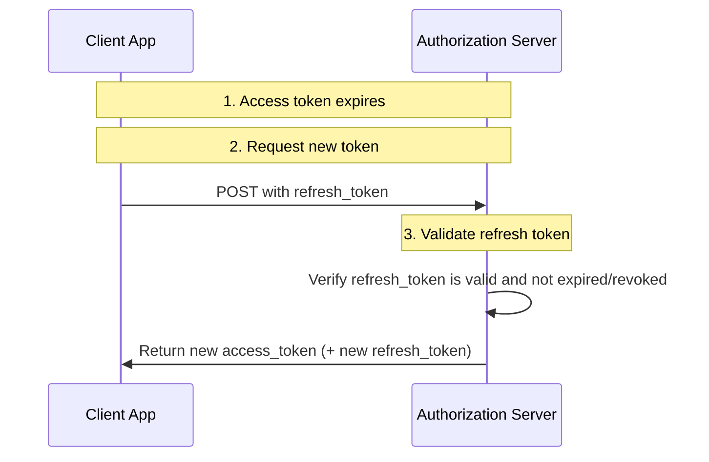
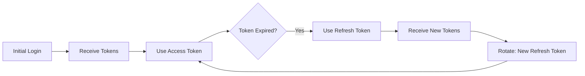

# Refresh Token Flow

The Refresh Token Flow allows clients to obtain new access tokens without requiring the user to re-authenticate. This provides a seamless user experience while maintaining security.

## Overview

When an access token expires, the client can use a refresh token to obtain a new access token (and optionally a new refresh token) from the authorization server.

### Why Use Refresh Tokens?

- **Better User Experience**: Users stay logged in without re-entering credentials
- **Shorter Access Token Lifespan**: Reduces security risk if access token is compromised
- **Revocation Capability**: Users can revoke refresh tokens to logout everywhere

### When to Use

- When access tokens have expired
- When implementing "remember me" functionality
- When building long-lived applications
- When access tokens have short expiration times

## Flow Diagram



### Step-by-Step

1. **Initial Token Acquisition**
   - Client obtains both access_token and refresh_token during initial authentication
   - Access token has short lifespan (e.g., 1 hour)
   - Refresh token has longer lifespan (e.g., days or weeks)

2. **Access Token Expires**
   - Client attempts API call with expired access token
   - API returns 401 Unauthorized

3. **Request New Token**
   ```
   POST /token
   Content-Type: application/x-www-form-urlencoded

   grant_type=refresh_token
   &refresh_token=YOUR_REFRESH_TOKEN
   &client_id=YOUR_CLIENT_ID
   &client_secret=YOUR_CLIENT_SECRET
   ```

4. **Receive New Tokens**
   ```json
   {
     "access_token": "eyJ...",
     "token_type": "Bearer",
     "expires_in": 3600,
     "refresh_token": "new_refresh_token...",
     "scope": "read:profile"
   }
   ```

5. **Continue Accessing Resources**
   - Client uses new access token for API calls

### Block Diagram

```mermaid
block-beta
    columns 2

    space

    block:2,1
        columns 2
        Client["Client App"]<-->Auth["Auth Server"]
    end

    space

    note:1,1 Auth handles<br/>token refresh

    style Client fill:#e8f5e8
    style Auth fill:#fff3e0
```

## Token Storage Best Practices

### Where to Store Tokens

| Storage | Access Token | Refresh Token | Recommended For |
|---------|-------------|--------------|-----------------|
| Memory | Yes | No | Single Page Apps |
| HttpOnly Cookie | Yes | Yes | Server-side apps |
| Session Storage | Yes | No | SPAs |
| Local Storage | No | No | Never recommended |
| Secure Cookie | Yes | Yes | High-security apps |

### Security Recommendations

1. **Never store tokens in localStorage** - Vulnerable to XSS attacks
2. **Use HttpOnly cookies** for refresh tokens when possible
3. **Encrypt tokens** if stored server-side
4. **Implement token rotation** - issue new refresh token with each refresh

## Refresh Token Security

### Token Rotation

Each time you use a refresh token, request a new one to limit the lifetime of each token.



### Scenarios That Invalidate Refresh Tokens

- User explicitly logs out
- User changes password
- Admin revokes tokens
- Token expires (set expiration)
- Suspicious activity detected
- User account is disabled

### Best Practices

1. **Short-lived access tokens** (15 min - 1 hour)
2. **Longer-lived refresh tokens** (days - weeks)
3. **Rotate refresh tokens** on each use
4. **Track refresh token usage** for anomaly detection
5. **Implement refresh token revocation**

## Implementation Example

```python
import requests
import time

class TokenManager:
    def __init__(self, auth_url, client_id, client_secret):
        self.auth_url = auth_url
        self.client_id = client_id
        self.client_secret = client_secret
        self.access_token = None
        self.refresh_token = None
        self.token_expires_at = 0

    def get_valid_token(self):
        # Check if token is expired or about to expire
        if time.time() >= self.token_expires_at - 300:  # 5 min buffer
            self._refresh_token()
        return self.access_token

    def _refresh_token(self):
        response = requests.post(self.auth_url + "/token", data={
            "grant_type": "refresh_token",
            "refresh_token": self.refresh_token,
            "client_id": self.client_id,
            "client_secret": self.client_secret
        })

        if response.status_code == 200:
            data = response.json()
            self.access_token = data["access_token"]
            self.refresh_token = data.get("refresh_token", self.refresh_token)
            self.token_expires_at = time.time() + data["expires_in"]
        else:
            raise Exception(f"Token refresh failed: {response.text}")

# Usage
token_manager = TokenManager(
    "https://auth.example.com",
    "my_client_id",
    "my_client_secret"
)
token_manager.refresh_token = "initial_refresh_token"

# Get a valid token
token = token_manager.get_valid_token()
```

## Comparison

| Aspect | With Refresh Token | Without Refresh Token |
|--------|-----------------|---------------------|
| User experience | Seamless | Must re-login |
| Security | Better (shorter access token) | Riskier |
| Complexity | Higher | Simpler |
| Logout control | Yes | Limited |
| Token revocation | Yes | No |