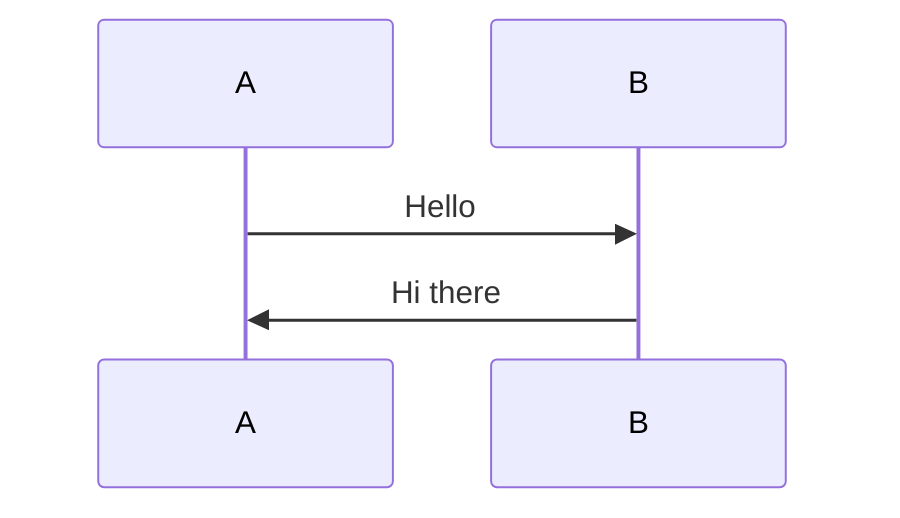

# OAuth 2.0 Guide - MkDocs Setup

This documentation site is built with [MkDocs](https://www.mkdocs.org/) and the Material theme.

## Quick Start

### View Locally

```bash
# Install dependencies
pip install -r requirements.txt

# Run development server
mkdocs serve
```

Then open http://localhost:8000 in your browser.

### Build for Production

```bash
mkdocs build
```

Output will be in the `site/` directory.

## Project Structure

```
/OAuth
├── index.md                    # Homepage
├── authorization-code-flow.md # Auth Code Flow documentation
├── client-credentials-flow.md # Client Credentials documentation
├── device-code-flow.md        # Device Code documentation
├── refresh-token-flow.md      # Refresh Token documentation
├── mkdocs.yml               # MkDocs configuration
├── requirements.txt          # Python dependencies
├── .github/workflows/
│   └── deploy.yml          # GitHub Actions workflow
└── site/                  # Built site (generated)
```

## Editing Content

1. Edit the `.md` files
2. Run `mkdocs serve` to preview
3. Push to main branch - GitHub Actions will auto-deploy

## Mermaid Diagrams

Mermaid diagrams render automatically using the `mermaid2` plugin.



## GitHub Pages Deployment

The site automatically deploys when you push to main:
1. GitHub Actions runs the workflow
2. MkDocs builds the site
3. Deploys to GitHub Pages

Check deployment status in **Actions** tab.